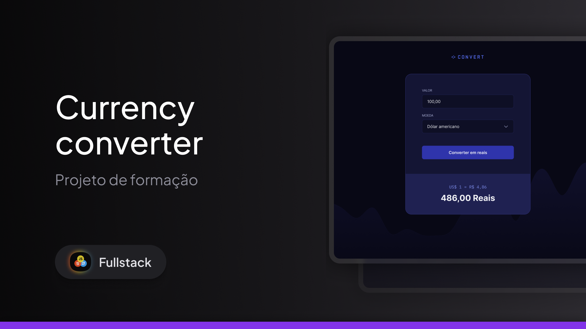

<h1 align="center"> Currency converter</h1>

  <a href="#-Technologies">Technologies</a>&nbsp;&nbsp;&nbsp;|&nbsp;&nbsp;&nbsp;
  <a href="#-projeto">Project</a>&nbsp;&nbsp;&nbsp;|&nbsp;&nbsp;&nbsp;
  <a href="#-layout">Layout</a>

 

  

## 🚀 Technologies

This project was developed with the following technologies:

## 💻 Project

Convert is a web application for converting currencies to reais.

> ⚠️ **Note:** This currency converter does **not** use real-time exchange rates.  
> The values may be outdated, as they are based on previously available data and do not reflect current market rates.

## 🔖 Layout

You can view the project layout through [FROM THIS LINK](https://www.figma.com/design/6R05S6UUYe164wX8DiVki1/Conversor-de-Moedas--Community-?node-id=0-1&t=c3vlv8kMuc7b4qus-1). It is necessary to have an account on
 [Figma](https://figma.com) to access it.

---

Made by : [Augusto Valerio](https://github.com/Augusto-Valerio).
